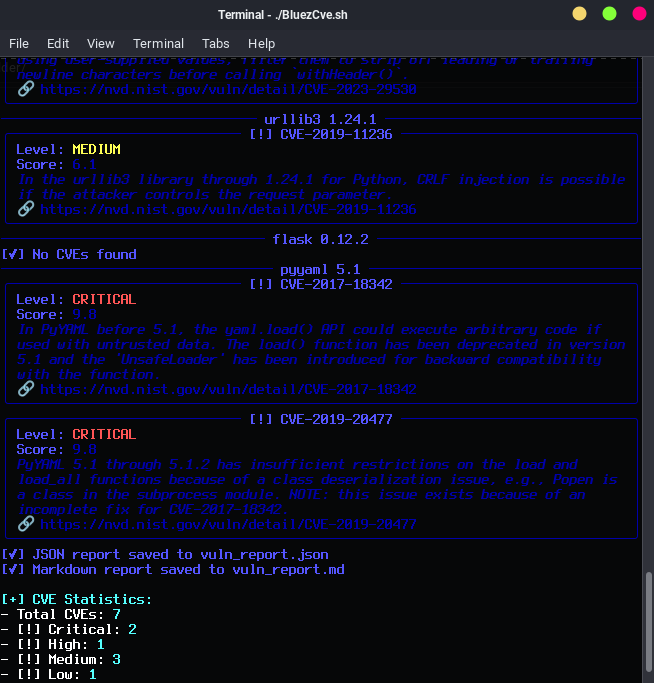

# BluezCve

**BluezCve** is a Python-based tool designed to scan your project's dependencies against the CVE (Common Vulnerabilities and Exposures) database. It helps identify packages with known security vulnerabilities in an automated and efficient manner.

---
## Features
- Query CVEs bound to CPEs for better precision
- Check vulnerabilities from a dependency file or directly from the active environment (`pip freeze`)
- Query CVE data from public databases (NVD)
- Display vulnerability statistics grouped by severity
- Clean and readable terminal output using `rich`
- Export results to JSON and Markdown
- Fallback to keyword-based search when CPE resolution is unavailable
- Generate public reference links for:
  - Linux kernel
  - Windows kernel
  - macOS XNU kernel
  Kernel modes generate reference links only and do **not** scan or analyze the running kernel.
### Optional API Enrichment
When an API key is provided:
- **EPSS** score for exploit likelihood context
- **KEV** flag for known exploited vulnerabilities
API usage is optional and intended for more advanced analysis.
### Output Formats
- Console (human-readable)
- JSON
- Markdown
---
## Installation

```bash
    git clone https://github.com/bluezapus/BluezCve.git
```
```bash
    chmod +x ./install.sh
```
```bash
    ./install.sh
```

## Manual instalation
```bash
    https://github.com/bluezapus/BluezCve.git
cd BluezCve
python -m venv .venv
source venv/bin/activate
pip install -r requirements.txt
```
## 
#### Usage
```bash
    chmod +x ./BluezCve.sh
```
```bash
    ./BluezCve.sh
```
### or

#### After Install all dependencies requirements.txt and activate Venv

```bash
   BluezCve -h
```

|Purpose|Command|Description|
|---|---|---|
|Show help|`bluezcve -h`|Display available options and usage information|
|Check CVE for a package|`bluezcve -p openssl -v 1.1.1`|Query CVEs for a specific package and version|
|Scan requirements.txt|`bluezcve -r requirements.txt`|Scan CVEs for dependencies listed in a requirements file|
|Scan current environment|`bluezcve --freeze`|Scan CVEs from current Python environment (`pip freeze`)|
|Export JSON report|`bluezcve -p flask -v 2.2.5 --json`|Export CVE results to JSON format|
|Export Markdown report|`bluezcve -p django -v 4.2 --md`|Export CVE results to Markdown format|
|Quiet mode|`bluezcve -p requests -v 2.31.0 --quiet`|Suppress console output|
|Linux kernel references|`bluezcve --linux-kernel`|Generate Linux kernel vulnerability reference links|
|Windows kernel references|`bluezcve --win-kernel -v 10.0`|Generate Windows kernel vulnerability reference links|
|macOS kernel references|`bluezcve --mac-kernel`|Generate macOS XNU kernel vulnerability reference links|


## Example results



---
## Disclaimer

This tool is for educational and research purposes only. The author is not responsible for misuse or incorrect interpretations.