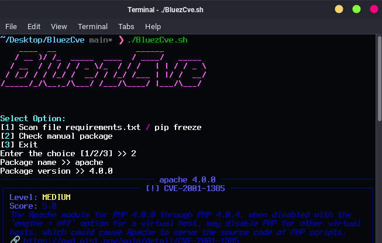

# BluezCve

**BluezCve** is a Python-based tool designed to scan your project's dependencies against the CVE (Common Vulnerabilities and Exposures) database. It helps identify packages with known security vulnerabilities in an automated and efficient manner.

---

## Feature
- Detects vulnerabilities from a `file.txt` or directly from the active environment via `pip freeze`
- Connects to the CVE database through an API (e.g., NVD)
- Displays vulnerability statistics based on severity levels
- Clean and informative terminal output using `rich`


---

## Instalation

```bash
    git clone https://github.com/bluezapus/BluezCve.git
```
```bash
    chmod +x ./install.sh
```
```bash
    ./install.sh
```

## Manual instalation
```bash
    https://github.com/bluezapus/BluezCve.git
cd BluezCve
python -m venv venv
source venv/bin/activate
pip install -r requirements.txt
```
## 
#### Usage
```bash
    chmod +x ./BluezCve.sh
```
```bash
    ./BluezCve.sh
```
### or

#### After Install all dependencies requirements.txt and activate Venv

```bash
    python3 -m BluezCve
```





- ##### 1. Scan using `file.txt` Or directly from the active environment via 'Pip Freeze'
- ##### 2. Scanning directly for CVEs based on the package `name` and `version`
- ##### 3. Exit Program


## Example results

